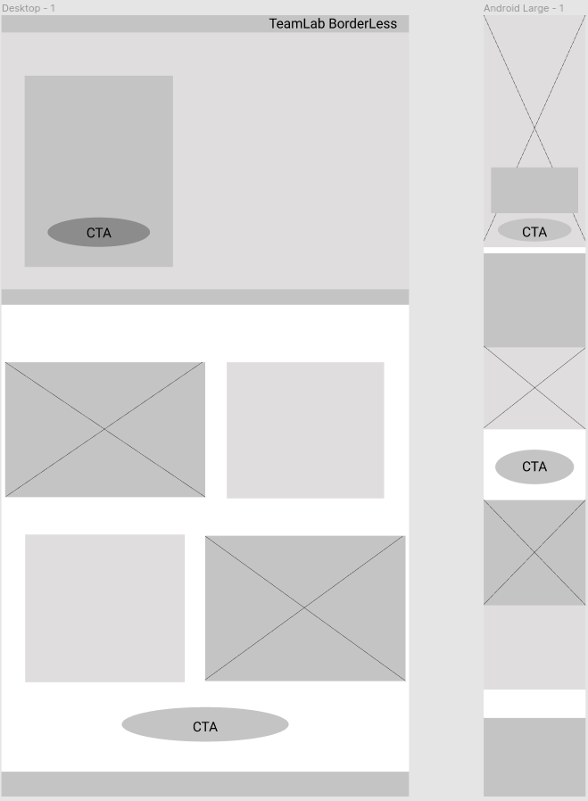
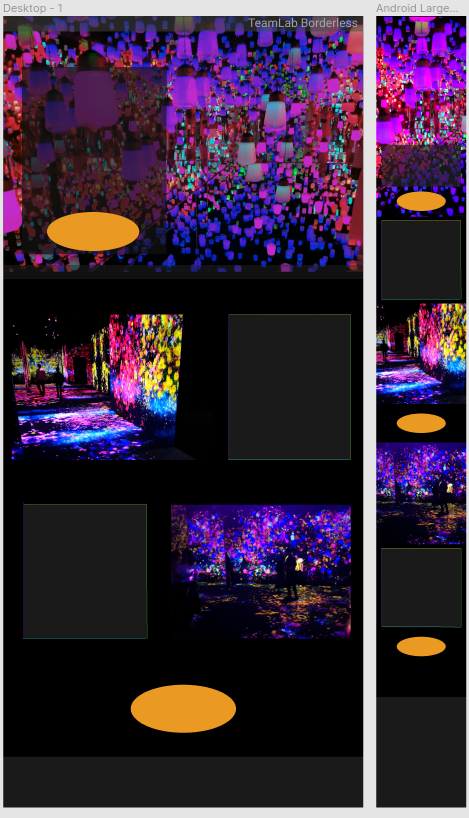

## Teamlab Borderless Landing Page Project

Création d'une landing page pour un projet de formation. L'objectif de ce projet est de travailler sur la responsivité du site et sur les frameworks CSS.
Le sujet de la landing page doit toucher un thème artistique ou touristique.

Thème choisi : Teamlab Borderless, musée d'arts numériques à Tokyo.
"Framework" CSS : Sass

### Wireframe et framework

Réalisées sur Figma.

